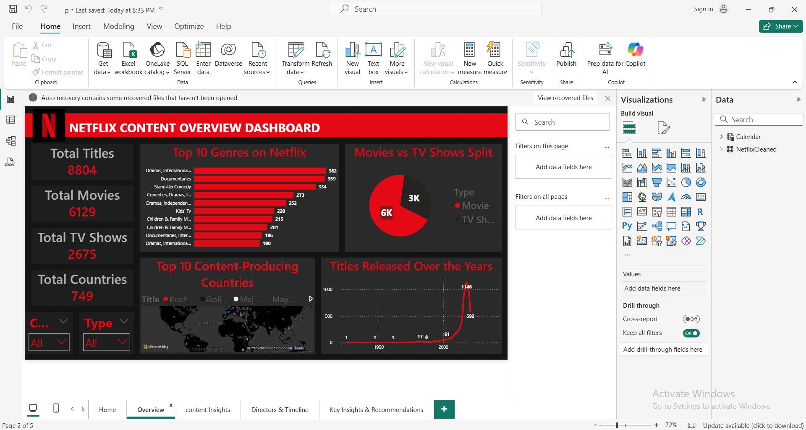

# Netflix Data Analysis

## Overview
This project analyzes the Netflix Titles dataset using **SQL Server** for data cleaning and **Power BI** for dashboard visualization.

## Tools Used
- SQL Server
- Power BI (Power Query, DAX)
- Excel / CSV for raw data

## Main Insights
- Library growth peaked between **2018–2020**
- **Movies** dominate but **TV Shows** are increasing
- Top countries: **USA**, **India**, **UK**
- Most titles rated **TV-MA**
- Emerging markets like **India** & **Korea** expanding rapidly

## Recommendations
- Improve data completeness (missing directors/cast)
- Invest in regional productions
- Balance movie vs show content
- Track yearly trends for audience demand

## Dashboard Preview

## Author
Created by [Nourhan Adel] — 2025

